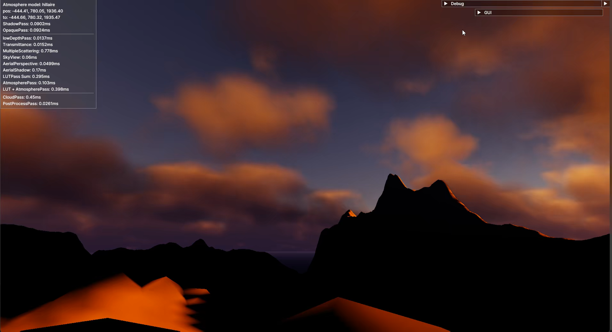
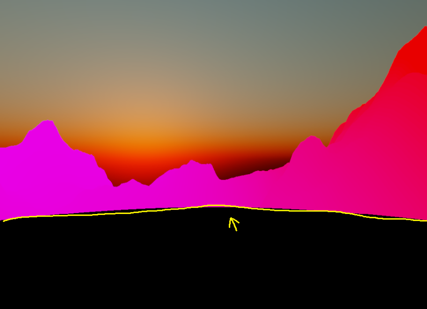
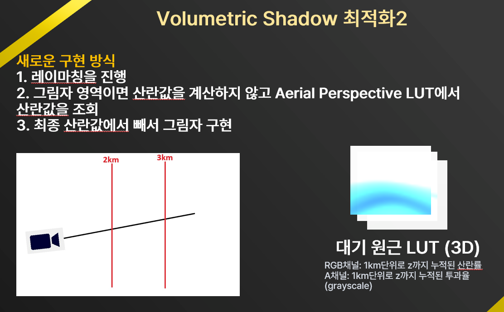
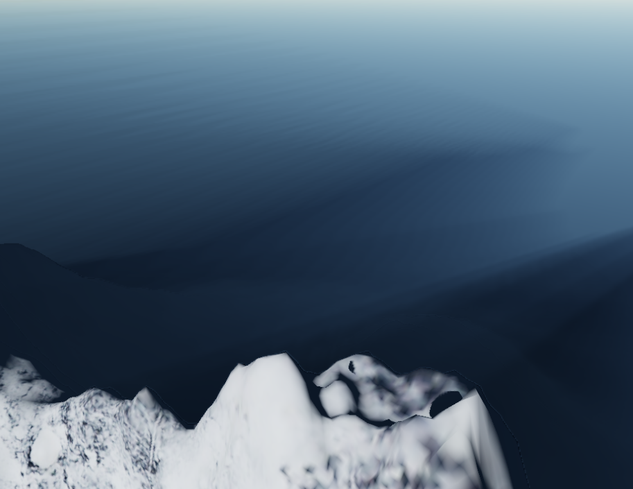
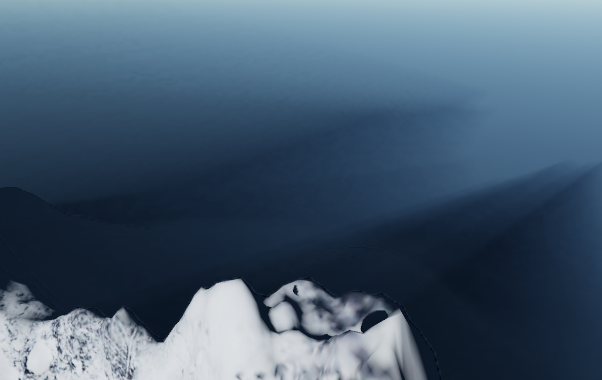
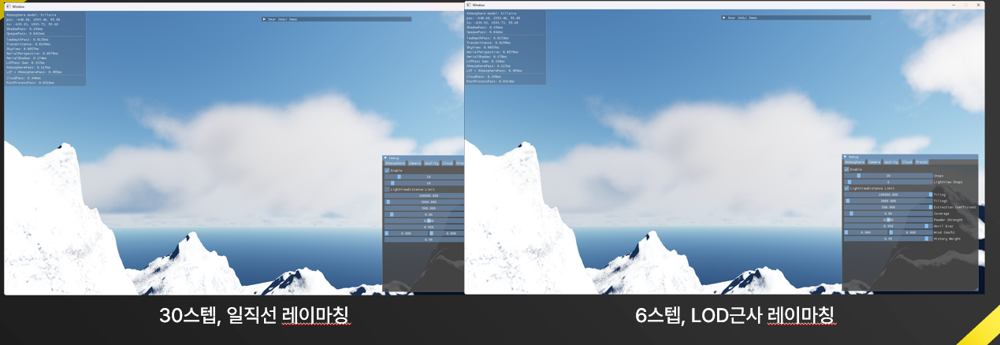
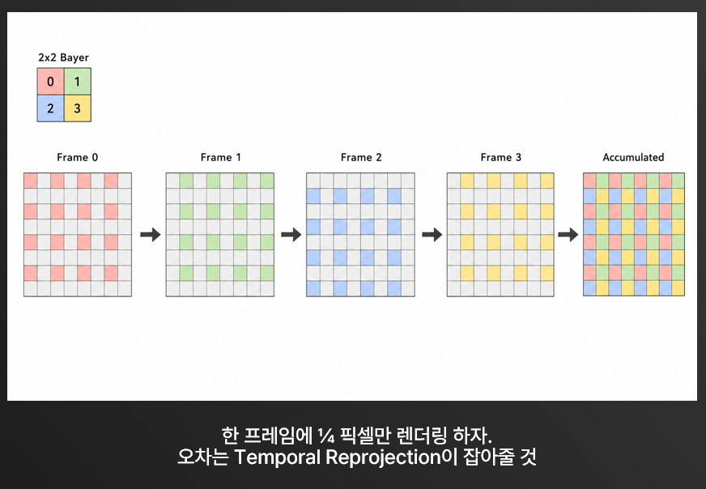

# Volumetric Weather - 8주간의 개발 노트

Vulkan 기반 실시간 환경 렌더러의 구현 범위, 설계 판단, 최적화 결과를 정리한 기술 문서입니다.

| 항목 | 내용 |
| --- | --- |
| 개발 기간 | 8주 |
| 기술 | C++20, Vulkan 1.2, GLSL |
| 구현 범위 | 물리 기반 대기, 체적 그림자, 볼류메트릭 구름, 아티스트 파라미터 |
| 설계 목표 | 태양광과 대기 정보를 공유하는 환경 구성, 실시간 렌더링 비용 확보, 직관적인 환경 제어 |
| 최종 개발 단계의 측정 | 대기 + 구름: RTX 3060 Ti 약 1.1 ms / RTX 5060 Ti 약 0.7 ms |

성능은 장면과 설정에 따라 달라지며 전체 프레임 시간이 아닌 환경 렌더링 비용입니다. [실행 방법과 데모](../README.md)



## 1. 구현 구성

| 구성 요소 | 구현 내용 | 설계 의도 |
| --- | --- | --- |
| 대기 렌더링 | Hillaire 기반 LUT, 다중 산란, 대기 원근 | 반복되는 대기 적분을 LUT 조회로 대체 |
| 체적 그림자 | 그림자 구간 탐색, 누적 산란 LUT 차분 | 가려진 구간의 산란광을 재계산 없이 근사 |
| 구름 | 3D 노이즈 밀도장, 레이마칭, LOD 광원 샘플링 | 형태의 세부 표현과 광원 계산의 정밀도를 분리 |
| 시간적 재사용 | Temporal Reprojection, Neighborhood Clamping, 픽셀 분할 갱신 | 프레임당 계산량 감소와 잔상 억제 |
| 저해상도 합성 | 깊이 기반 업샘플링 | 배경과 물체의 경계를 유지하며 처리 픽셀 수 감소 |
| 환경 제어 | 사용자 입력을 내부 렌더링 설정으로 변환 | 유효한 조절 범위와 파라미터 간 관계를 UI에 반영 |
| 렌더러 기반 | 패스별 이미지 사용 선언, 자동 배리어, GPU 시간 / RMSE 측정 | 패스 조합 변경과 구현 간 비교 지원 |

## 2. 대기 렌더링

### LUT 구성

Sébastien hillaire의 'A Scalable and Production Ready Sky and Atmosphere Rendering Technique'를 기반으로 합니다.

표면색은 대기 투과율로 감쇠시키고, 시선 방향의 누적 산란광을 더해 합성합니다.

반복되는 산란 연산을 LUT에 미리 저장해두는 방식으로 연산을 줄이는 구조입니다.

```text
관측 색 = 대기 투과율 × 표면색 + 누적 대기 산란광
```

| LUT | 저장 정보 | 사용처 |
| --- | --- | --- |
| Transmittance | 고도, 광선 방향별 투과율 | 대기 샘플 -> 광원 방향의 투과율 조회 |
| Sky-View | 시선 방향별 하늘 산란광 | 하늘 렌더링 |
| Aerial Perspective | 화면 방향, 거리별 누적 산란광과 투과율 | 지형의 대기 원근, 구름 합성, 체적 그림자 |
| Multiple Scattering | 고도, 태양 방향별 다중 산란 정보 | 단일 산란 모델 보완 |

해상도와 스텝 수를 변경하며 비용과 화면 차이를 비교했습니다.</br>
4주차에서 비교할 당시 Sky-View 너비 150, 높이 200, 40 스텝 이상, Aerial Perspective 5 스텝 이상에서 시각적 변화가 작았습니다. 이를 당시 설정 선택의 기준으로 사용했습니다. 다중 산란은 7주차에 추가했습니다.

**검증:** GPU timestamp로 패스 시간을 측정하고, 기반 모델과 LUT 모델의 RGB 채널별 전체 RMSE를 계산했습니다. RMSE는 구현 간 이미지 차이를 나타내며 물리적 정확도 자체를 보장하지 않습니다.</br>
다만 RMSE는 특정 구간만 색이 다를 경우에도 오차가 작게 측정되기 때문에 초반에만 검증 기준으로 썼습니다.

### 구체 대기 모델의 오류 수정



| 증상 | 확인 과정 | 원인 / 처리 |
| --- | --- | --- |
| 화면에 검은 원 발생 | 합성, UBO 입력, 수치 연산 확인 | 지면 아래 샘플의 음수 고도로 밀도 지수항이 과도하게 증가. 적분 과정에서 NAN값이 되버림. 지면 아래 적분 방지 필요 |
| 고고도 지평선 밴딩 | 스텝 증가의 효과가 작고, m->km 단위 변경도 효과 없음. HDR 기록과 광선 교차 구간 확인 | 적분 구간이 지면을 관통. 대기 진입점부터 가장 가까운 유효 지면 교차점까지로 구간 수정 |

## 3. 체적 그림자

### 문제와 접근 비교

Hillaire의 대기 모델에는 체적 그림자에 대한 내용이 없었습니다.

이를 구현하기 위해 처음에는 가려진 구간의 산란광을 계산해 최종 산란광에서 빼는 방식을 구현했습니다. 하지만 그림자 미포함 0.14 ms에서 포함 4.4 ms로 비용이 증가했습니다.

| 접근 | 결과 & 제약 | 판단 |
| --- | --- | --- |
| Aerial Perspective LUT에 그림자 직접 기록 | 화면 방향 해상도 32×32로 세밀한 그림자 표현 부족 | 별도 그림자 구간 탐색으로 분리 |
| 그림자 전용 산란 레이마칭 40->20 스텝 | 4.4->2.2 ms. 먼 거리에서 품질 저하 | 스텝 감소만으로 해결하기 어려움 |
| 저해상도 렌더링 | 계산량 감소, 물체 외곽선 오류 발생 | 깊이 기반 업샘플링과 결합 |
| 블루 노이즈 지터링 | 규칙적인 밴딩을 불규칙한 노이즈로 분산 | 저해상도 렌더링에 적용 |
| 광원 방향으로 확장한 메시의 깊이 차 이용 | 고폴리곤 처리 비용과 태양 방향 변경 시 재생성 비용 | 미채택 |
| AerialPerspective LUT의 결과 재사용 | 그림자 상태 탐색과 산란량 계산 분리 | 최종 접근으로 적용 |

### AerialPerspective LUT 결과 재사용



```text
S(d) = 카메라에서 거리 d까지의 누적 산란광
그림자 구간 [a, b]의 산란 기여 ≈ S(b) - S(a)
```

1. 시선 방향으로 레이마칭하며 샘플의 그림자 상태를 판정합니다.
2. 그림자 진입 시점에 누적 산란값을 저장합니다.
3. 그림자 이탈 시점의 누적값에서 진입값을 빼 차폐된 산란량을 누적합니다.
4. 광선 끝까지 그림자가 이어지는 구간도 처리한 뒤, 최종 대기 산란광에서 차감합니다.

**선택 이유:** 이미 계산한 Aerial Perspective 정보를 재사용할 수 있고, 매 스텝 산란 연산과 LUT 조회를 수행하는 비용을 줄일 수 있습니다. 그림자 경계는 별도로 탐색하므로 낮은 해상도의 LUT에 경계를 직접 저장하지 않습니다.


### 저해상도 경계 처리

저해상도 픽셀이 지형과 배경을 함께 대표하면 확대 과정에서 잘못된 깊이의 그림자가 섞입니다. 주변 2×2 샘플 중 현재 고해상도 픽셀과 깊이가 가까운 샘플에 높은 가중치를 주는 Depth-Aware Upsampling을 적용했습니다.

| 40 스텝, 지터링 없음 | 40 스텝, 블루 노이즈 지터링 |
| --- | --- |
|  |  |

## 4. 볼류메트릭 구름

### 밀도장과 합성

- Perlin-Worley 노이즈로 기본 형태를 구성하고, Worley 노이즈 3개를 FBM으로 합성해 외곽 디테일을 추가했습니다.
- 구름층 내부에서 레이마칭을 시작하고 투과율이 0.01 이하이면 조기 종료합니다.
- 구름까지의 대기 산란광과 투과율은 Aerial Perspective LUT를 재사용합니다.

### 최적화와 품질 문제

| 문제 | 적용 방식 | 결과 & 제약 |
| --- | --- | --- |
| 조기 종료 적용 후에도 약 11 ms의 비용 | Temporal Reprojection | 도입 단계에서 약 3 ms로 감소 |
| 구름은 명확한 표면 위치가 없어 재투영 기준이 불명확 | 투과율 변화 기여에 따른 샘플 위치의 가중 평균 실험 | 얇은 경계에서 가중치 합이 흔들려 대표 위치 불안정 |
| 얇은 구름의 재투영 흔들림 | 신뢰도가 낮은 구간에 구름층 시작 위치 사용 | 대표 위치의 프레임 간 안정성 보완 |
| 높은 History Weight로 잔상 발생 | Neighborhood Clamping | 고스팅 감소, 완전 제거에는 한계 |
| 저해상도에서 먼 구름의 디테일 손실 | 비용과 품질 비교 후 해상도 선택 | TR 적용 시 1/2 해상도 1.55 ms, 1/4 해상도 0.75 ms |
| 지평선 방향의 긴 광원 레이에서 색이 프레임마다 변동 | 거리 제한 실험 후 LOD 샘플링 도입 | 시간적 혼합 이전의 입력 변동을 줄이는 방향으로 개선 |

### 광원 방향 LOD 샘플링


태양 방향의 투과율 계산에서 가까운 구간에 샘플을 집중하고, 먼 구간은 높은 밉 레벨로 주변 밀도를 근사했습니다. 비교 실험에서는 광원 방향의 일직선 레이마칭 30 스텝을 LOD 근사 6 스텝으로 줄였습니다.

**선택 이유:** 구름 자기 자신에 의해 생기는 그림자를 표현할 때 연산량을 줄이기 위해 근사가 필요했습니다. 정확하진 않지만 시각적으로 큰 차이는 없기에 채택했습니다.

### 프레임별 픽셀 분할


2x2 패턴의 네 위치를 순환하며 한 프레임에 구름 픽셀의 1/4을 갱신합니다. 나머지 위치는 이전 프레임 결과를 재투영해 사용합니다. 이는 출력 격자 자체를 줄이는 해상도 축소와 별개의 최적화입니다.

## 5. 아티스트 파라미터

**문제:** 태양 방향 벡터, 산란 계수, 노이즈 타일링을 직접 노출하면 입력값과 시각적 결과의 관계를 예측하기 어렵습니다.

**설계:** 사용자 설정과 렌더링 설정 사이에 변환 계층을 두고, 의미 있는 조절 범위와 서로 영향을 주는 파라미터의 관계를 정의했습니다.

| 사용자 입력 | 내부 처리 | 설계 목적 |
| --- | --- | --- |
| 시간/월/위도/자전축 | 태양 방향 벡터 계산 | 시간대에 따른 조명 제어 |
| 에어로졸 강도/방향성/색 | Mie 파라미터로 변환 | 대기 흐림과 빛의 확산 조절 |
| Cloud Amount 0-1 | Coverage 0-0.2로 선형 매핑 | 변화가 유효한 구간을 입력 범위 전체에 배분 |
| 구름 크기 & 디테일 | 기본 크기에 따라 세부 노이즈 타일링 연동 | 크기 변경 시 디테일 비율 유지 |
| 베지어 커브 | 구름 밝기 커브 설정 | 수식의 계수 대신 곡선 형태로 제어 |
| 바람 방향 & 속도 | 바람 벡터 변환, 시간과 동기화 | 방향과 속도 단위로 구름 이동 제어 |

관련 코드: [ParameterMapper.cpp](../src/weather/ParameterMapper.cpp), [ArtistGUI.cpp](../src/weather/ArtistGUI.cpp), [CurveEditor.cpp](../src/CurveEditor.cpp)

## 6. 렌더러 구조와 측정

| 기능 | 구현 | 목적 / 범위 |
| --- | --- | --- |
| 이미지 사용 선언 | 패스별 `AddUsage` | 패스가 요구하는 이미지 상태 명시 |
| 자동 배리어 | `BarrierBuilder`가 이전과 다음 사용 추적 | 전달된 패스 순서에 따른 이미지 배리어 생성 |
| GPU 시간 측정 | 패스별 timestamp | 병목 구간과 최적화 결과 확인 |
| 이미지 비교 | Readback 후 RGB RMSE 계산 | 기반 대기와 LUT 대기의 오차 비교 |
| CPU/GPU 실행 흐름 | 커맨드 제출 후 Update, BeginRender에서 fence 대기 | GPU 실행 중 CPU 작업 진행 |

관련 코드: [BarrierBuilder.cpp](../src/render/BarrierBuilder.cpp), [GPUTimer.cpp](../src/render/GPUTimer.cpp), [Scene.cpp](../src/Scene.cpp)

## 7. 성능 기록

개발 단계별 측정값입니다. 행마다 기능 구성과 장면이 다르므로 하나의 연속된 벤치마크로 합산하거나 비교하지 않습니다.

| 단계 | 측정 대상 / 조건 | GPU 시간 |
| --- | --- | --- |
| 4주차 | 기반 대기 64 스텝 / Hillaire 대기 | 11 ms / 0.14 ms |
| 4주차 | 대기, 체적 그림자 미포함 / 포함 40 스텝 | 0.14 ms / 4.4 ms |
| 5주차 | 그림자 최적화, 40 스텝·지터링, 1/2 / 1/4 해상도 | 0.5 ms / 0.22 ms |
| 6주차 | 구름, Temporal Reprojection 전 / 후 | 11 ms / 3 ms |
| 6주차 | 구름, TR 적용·1/2 / 1/4 해상도 | 1.55 ms / 0.75 ms |
| 7주차 | LOD 적용 구름, 제한적인 장면 / 구름이 많은 개활지 | 0.295 ms / 0.8-1.1 ms |
| 8주차 | 대기 + 구름, RTX 3060 Ti | 약 1.1 ms |
| 8주차 | 대기 + 구름, RTX 5060 Ti | 약 0.7 ms |

- 1/2와 1/4 해상도는 가로 세로 축의 축소 비율이며 픽셀 수는 각각 원본의 1/4, 1/16입니다.
- 4주차 대기 수치에는 7주차에 추가한 다중 산란이 포함되지 않습니다.
- 위 표는 개발 당시 기록에 디버그 빌드도 포함 돼 있습니다. 또한 개발 당시 컴퓨터의 사양은 RTX5060TI입니다.

## 8. 주차별 개발 이력

| 주차 | 주요 작업 | 설계 / 검증 초점 |
| --- | --- | --- |
| 1주차 | Vulkan 렌더러 기반, 주제 선정 | 기반 설계 |
| 2주차 | 메시-텍스처 로더, 구체 대기 레이마칭 | 대기 레이마칭 기법 조사 |
| 3주차 | 기반 대기, 광원 & 그림자, 투과율 LUT, GPU timestamp | 비교 가능한 렌더링, 측정 기반 확보 |
| 4주차 | Sky-View, Aerial Perspective LUT, RMSE 분석, 체적 그림자 | LUT 설정과 화면 오차 비교, 그림자 병목 확인 |
| 5주차 | 대기 그림자 근사, 지터링, 깊이 기반 업샘플링, 초기 구름 | 저해상도 경계 보존, 메시 근사 비용 검토 |
| 6주차 | 누적 LUT 그림자, 구름 디테일, 재투영 | 계산 재사용, 대표 위치의 시간적 안정성 |
| 7주차 | 다중 산란 LUT, 구름 광원 LOD, 파라미터 변환 계층 | 거리별 샘플 정밀도 배분, 입력 범위 설계 |
| 8주차 | 픽셀 분할 갱신 정리, 환경 제어, 통합 결과 검증 | 성능과 조작성 확인 |

코드 링크는 현재 저장소를 기준으로 하며, 주차별 구현 스냅샷을 의미하지 않습니다.